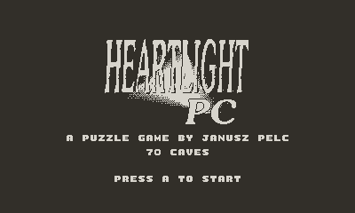
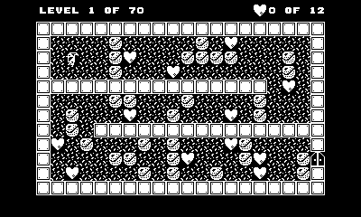

# Heartlight for Playdate

A port of **Heartlight PC** (1994) to the [Playdate](https://play.date). The game
is reconstructed in Lua from the original DOS C source, reproducing the original
mechanics, data, and feel — right down to its deliberate **~8.9 fps** cave pace.

Heartlight is a grid puzzle of falling rocks and dig-and-collect: dig through
grass, push rocks, dodge falling hazards and bombs, collect every heart to open
the exit, then step through it to clear the cave.




## Download

The finished game is **available to download on itch.io** — grab the `.pdx`
and sideload it to your Playdate:

* **[Heartlight PC for Playdate on itch.io](https://tosiabunio.itch.io/heartlight-pc-for-playdate)**

(Or [build it yourself](#building).)

## About Heartlight PC

Originally created by Polish developer Janusz Pelc for 8-bit Atari computers in
1990, the game was ported to MS-DOS in 1994 by xLand Games and published
worldwide by Epic MegaGames (now Epic Games) as part of the Epic Puzzle Pack.

Heartlight PC is a grid-based puzzle game heavily inspired by classics like
Boulder Dash and Supaplex. The player controls an elf named Percival (or
"Mosiek" in the original Polish release) who must navigate through up to 70 rooms
to collect every heart on the screen, which unlocks the exit door. The challenge
comes from manipulating the environment and gravity. The grid is filled with
destructible grass, solid walls, falling boulders, and volatile bombs. Because
gravity pulls loose objects downward as soon as the space beneath them is
cleared, players must use precise timing and logic to clear paths without
dropping a boulder on Percival's head, trapping a necessary heart, or blowing up
the wrong section of the map.

## The original game

The original game can be played online at:

* [playDOSgames](https://www.playdosgames.com/online/heartlight-pc/)

The DOSBox version, ready to run on modern Windows, is available for free at
[GOG.com](https://www.gog.com/en/game/heartlight).

## Status

Playable end to end across all 70 caves. Implemented:

- **Rendering** — the original 22×14 cave grid (a 1-cell border around the 20×12
  play area), 16×16 1-bit tiles, the 320×192 play area centred on the screen, a
  HUD (cave number, hearts collected of required) in a bitmap font, and a title
  screen built from the original HEARTLIGHT logo.
- **Simulation** — the full physics, ported from the original `animate()` sweep
  and `*_proc` handlers: gravity (rocks / hearts / bombs fall and roll off each
  other), bombs (arm on impact, chain-explode), balloons (rise and push),
  plasma, doors, explosions, and jump-pad tunnels.
- **Hero** — walk and dig, push rocks / bombs / balloons (half-speed), teleport
  through tunnels, collect hearts, die by crushing or self-destruct, and exit
  through the opened door.
- **Flow** — sequential progression; clearing a cave slides to the next, dying
  retries the current one.
- **Progress** — cleared caves are saved to the datastore and marked with a
  *COMPLETED* badge when revisited; *reset progress* clears the record from the
  system menu.
- **Timing** — locked to the original **~8.88 fps**, derived from the DOS sound
  timer (PIT divisor 140, the ISR adding 2 per tick, `GAME_SPEED` 1920).
- **Sound** — the original `.SND` effect samples at every event, plus looping
  **title and in-game music** (the in-game track is the original `gsong` note
  chain pre-rendered to one sample). Music can be toggled from the system menu.

By design this port leaves out the original's player profiles, high-score table,
and the small windowed display mode.

## Controls

| Input | Action |
| --- | --- |
| Ⓐ | Start (on the title screen) |
| D-pad | Move the hero — walk, dig grass, push, collect |
| Ⓑ | Restart the current cave (self-destruct) |
| Ⓐ + ◄ / ► | Skip to the previous / next cave |
| Crank ↻ / ↺ | Skip to the next / previous cave |
| System menu → *title screen* | Return to the title |
| System menu → *music* | Toggle music on / off |
| System menu → *reset progress* | Clear all saved cave-completion records |

Collect every heart to open the exit door, then walk into it to clear the cave.

## Building

Requires the [Playdate SDK](https://play.date/dev/) (which provides `pdc`).

```powershell
# from the repository root
pdc source Heartlight.pdx
```

Then open `Heartlight.pdx` in the Playdate Simulator (or sideload it to a device).

## Running on a Playdate

1. Build `Heartlight.pdx` as above.
2. Upload it through the [Playdate sideload page](https://play.date/account/sideload/)
   (a Playdate account is required), then install it to your device from
   *Settings → Games*.

## Testing

A headless smoke test loads the **actual** Lua modules in an embedded Lua
interpreter — no Simulator needed — stubs the Playdate API, starts a cave and
walks the hero, and fails on any runtime error. (The Simulator only reports Lua
runtime errors to its own console, so this catches integration bugs that a plain
launch will not.)

Requires Python 3 with [`lupa`](https://pypi.org/project/lupa/):

```powershell
pip install lupa
python test/smoke.py
```

## Project structure

```
source/
  main.lua       game loop, title/playing/transition state machine, input
  elements.lua   element / state / mode enums, sprite mapping, char map
  grid.lua       the 22x14 cave grid (cave / state / phase / call arrays)
  cave.lua       LEVELS.HL parser + level loader (get_cave)
  sim.lua        physics: animate() + per-element handlers, the hero
  render.lua     draw the cave grid + HUD
  title.lua      title screen (logo + prompt)
  sound.lua      sound effects + music
  save.lua       progress persistence — completed levels (datastore)
  images/        HL-table-16-16.png (sprite image table) + logo.png
  fonts/         the bitmap font used for all text
  sounds/        effect samples + title / game music (WAV)
  levels/        LEVELS.HL — 70 caves, plain text
  pdxinfo        bundle metadata
test/
  smoke.py       headless integration test (embedded Lua via lupa)
```

The 1-bit sprite image table and the title logo were converted from the original
game's `.GGS` sprite data, and the effect/music samples from its `.SND` data;
`LEVELS.HL` is the original plain-text cave definitions. The asset-conversion
tooling and the original C source live in a separate development repository.

## License

- **Port code** — everything under `source/*.lua` and `test/` — is licensed under
  the **MIT License**. See [LICENSE](LICENSE).
- **Game data, graphics, and sound** — `source/images/` (sprites, logo),
  `source/levels/` (the cave definitions), and `source/sounds/` (effects and
  music) — are converted from **Heartlight PC** (1994), which its authors
  released under **Creative Commons Attribution-ShareAlike** in 2006. Those
  assets remain under **CC BY-SA**.
- **Font** — `source/fonts/` is from idleberg's
  [playdate-arcade-fonts](https://github.com/idleberg/playdate-arcade-fonts),
  released into the public domain (**CC0 1.0**).

## Acknowledgments

- **Heartlight PC** (1994) and its authors, for the original game and for
  releasing it under CC BY-SA.
- The original DOS C source, used as the reference implementation for the
  mechanics, timing, and data formats.
- The display font is from [playdate-arcade-fonts](https://idleberg.github.io/playdate-arcade-fonts/) by idleberg (CC0), 
  hand-drawn after Toshi Omagari's *Arcade Game Typography*.
- Graphics converted by [Jakub Adamczyk](https://github.com/thesigns).
- Playdate port by [Claude Code](https://claude.com/claude-code) under the
  supervision of [Maciej Miąsik](https://github.com/tosiabunio) ([miasik.net](https://miasik.net/)).
